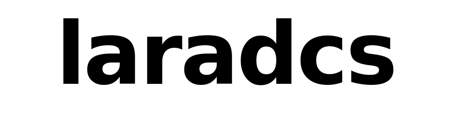
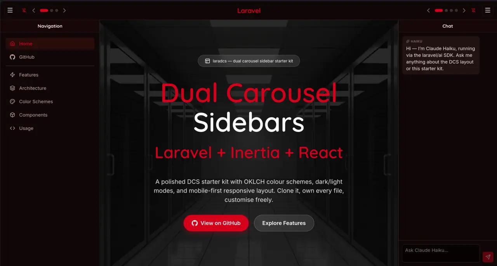

<div align="center">



**The Dual Carousel Sidebar starter kit for Laravel + Inertia + React.**

[](https://opensource.org/licenses/MIT)
[](https://laravel.com)
[](https://inertiajs.com)
[](https://react.dev)
[](https://tailwindcss.com)
[](https://vite.dev)
[](https://www.typescriptlang.org)

**✨ 100% proudly vibe coded by the one and only Claude Code ✨**



</div>

---

laradcs is an MIT-licensed Laravel starter kit built on the official
`laravel/react-starter-kit` foundation. It adds the **DCS (Dual Carousel
Sidebar)** layout pattern — a richer navigation shell than a single
collapsible sidebar, with two sidebars (LHS + RHS) that each host multiple
panels the user can swipe between horizontally.

Clone it, own every file, customise freely.

> **Status:** Phase 3 — DCS shell, demo dashboard (faithful port of the
> [dcs.spa](https://dcs.spa) reference), Anthropic Haiku chat panel via
> `laravel/ai`, and a full bleeding-edge stack (Laravel 13.5 / Inertia 3
> / Vite 8 / Tailwind 4.2 / TypeScript 6) are all live. Polished docs and
> a v1.0 release land in Phases 4–5.

---

## Features

- **Laravel 13.5** (PHP 8.3+) — full framework, not a stripped-down skeleton
- **Inertia.js 3** with the React adapter and persistent layouts
- **React 19.2 + TypeScript 6**
- **Tailwind CSS 4.2** (OKLCH-native, zero config)
- **Vite 8** with the rolldown backend (sub-400ms production builds)
- **shadcn/ui** primitives and **lucide-react 1.x** icons
- **laravel/ai** first-party LLM SDK with an Anthropic Haiku chat panel demo
- **laravel/mcp** (dev) — expose the running app to Claude Code / Cursor as an MCP server
- **Laravel Fortify** auth, **Pest 3** tests, **Laravel Pint** formatting
- **Ziggy** for type-safe routes, **SQLite** by default for zero-config boot
- **Dark mode** + five OKLCH colour schemes (Ocean, Crimson, Stone, Forest, Sunset)
- **DCS layout** — dual sidebars, carousel panels, scroll-reactive borders, glassmorphism hero

---

## Quick start

### Option 1 — Composer (works today)

```bash
composer create-project markc/laradcs my-app
cd my-app
bun install          # or: npm install
bun run dev          # or: npm run dev
# in another terminal:
php artisan serve
```

Then visit <http://localhost:8000>.

### Option 2 — Laravel installer (once published to the community registry)

```bash
laravel new my-app --using=markc/laradcs
```

> The `--using=` form requires laradcs to be published on Packagist and
> listed in the Laravel community starter kit registry. This will be
> available from the v1.0.0 tag onward.

### Option 3 — Git clone (for contributors and tinkerers)

```bash
git clone https://github.com/markc/laradcs my-app
cd my-app
cp .env.example .env
composer install
bun install
php artisan key:generate
php artisan migrate
bun run dev
```

---

## Requirements

- PHP **8.3+** (tested on 8.5)
- Composer **2.x**
- Node **20+** or Bun **1.x**
- SQLite, MySQL, MariaDB, or PostgreSQL
- (Optional) `ANTHROPIC_API_KEY` — enables the Haiku chat panel on the dashboard

---

## What is DCS?

Most Laravel apps ship with a single collapsible sidebar — clean, but
limiting. The **Dual Carousel Sidebar** pattern gives every app two sidebars
(left and right), and each sidebar holds multiple panels the user swipes
between horizontally like a carousel.

```
+-------------------------------------------------------------+
|  TopBar  [brand]  [search]              [theme]  [user]     |
+-----+-------------------------------------------------+-----+
|     |                                                 |     |
| LHS |                                                 | RHS |
|  <  |              Page content                       |  >  |
|  [] |                                                 |  [] |
|  >  |                                                 |  <  |
|     |                                                 |     |
+-----+-------------------------------------------------+-----+
```

- **Left sidebar:** primary navigation, tree views, project switchers,
  filters — the stuff you want one tap away.
- **Right sidebar:** contextual info, AI chat, activity feeds, inspectors,
  settings — the stuff that depends on what you're looking at.
- **Carousel switcher:** each sidebar can host N panels; a small switcher
  at the base of the sidebar moves between them with smooth animation.
- **Responsive:** on narrow screens both sidebars collapse into overlays;
  touch gestures handle panel navigation.

The full architecture doc will land in `docs/DCS-ARCHITECTURE.md`.

---

## Roadmap

laradcs ships in phases. The current release is the **Phase 1 scaffold** —
a clean Laravel + React starter with laradcs identity, MIT licensing, and a
stable repo ready for the DCS work to land incrementally.

- [x] **Phase 1** — Fork the official React starter kit, rebrand as
      `markc/laradcs`, publish MIT, initial README.
- [x] **Phase 2** — Extract DCS components from the
      [dcs.spa](https://dcs.spa) reference implementation into
      `resources/js/components/dcs/`.
- [ ] **Phase 3** — Replace the default `AppLayout` with the DCS shell.
- [ ] **Phase 4** — Example panels, demo pages, inline customisation notes.
- [ ] **Phase 5** — Full documentation: `DCS-ARCHITECTURE.md`,
      `CUSTOMISATION.md`, `THEMING.md`.
- [ ] **Phase 6** — Pest + Playwright tests, GitHub Actions CI.
- [ ] **Phase 7** — Tag v1.0.0, publish to Packagist, submit to
      `tnylea/laravel-new` registry.

Follow [releases](https://github.com/markc/laradcs/releases) for progress.

---

## Stack

| Layer          | Choice                                    |
|----------------|-------------------------------------------|
| Backend        | Laravel 12, PHP 8.2+                      |
| Auth           | Standard Laravel (Fortify variant planned)|
| Frontend       | Inertia 2 + React 19 + TypeScript         |
| Styling        | Tailwind CSS 4 with OKLCH tokens          |
| Primitives     | shadcn/ui + Lucide icons                  |
| Build          | Vite                                      |
| Tests          | Pest 3 (backend), Playwright planned      |
| Formatting     | Laravel Pint + Prettier + ESLint          |
| Database       | SQLite default, any Laravel-supported DB  |

---

## Customising

Because laradcs is a starter kit, **every file in the repository belongs
to the app you generate from it**. There is no runtime dependency on
laradcs itself — fork, delete, rename, rewrite. Nothing will break in a
future update because there *is* no future update; upstream changes land
as opt-in guidance in release notes, not as automatic dependency bumps.

Detailed customisation guides will land in the `docs/` directory as DCS
components arrive. In the meantime, the repo follows standard Laravel
conventions and upstream documentation from
[laravel.com/docs](https://laravel.com/docs/12.x) applies directly.

---

## Contributing

Contributions are welcome! The project is early, so the biggest help right
now is:

- **Testing the scaffold** on different environments and reporting issues.
- **Reviewing the plan** ([`../laradcs-plan.md`](https://github.com/markc/laradcs/blob/main/laradcs-plan.md) in the parent workspace) and proposing changes.
- **Feedback on the DCS pattern** from people building real Laravel apps.

For bugs and feature requests, please open an
[issue](https://github.com/markc/laradcs/issues). For code contributions,
fork the repo and open a pull request against `main`.

Before contributing code:

1. Run `./vendor/bin/pint` to format PHP.
2. Run `bun run format && bun run lint` to format/lint TypeScript.
3. Run `php artisan test` and make sure everything passes.

---

## Credits

- **[Mark Constable](https://github.com/markc)** — maintainer
- **[Laravel](https://laravel.com)** — the framework this kit extends
- **[Inertia.js](https://inertiajs.com)** — the SPA glue
- **[shadcn/ui](https://ui.shadcn.com)** — component primitives
- **[`laravel/react-starter-kit`](https://github.com/laravel/react-starter-kit)**
  — the upstream baseline this kit forks
- **[dcs.spa](https://dcs.spa)** — the reference DCS implementation this
  kit is extracted from
- All future contributors who help shape DCS into a shared pattern

---

## License

laradcs is open-sourced software licensed under the
[MIT License](LICENSE). Use it for anything, commercial or otherwise,
without attribution (though attribution is always appreciated).
